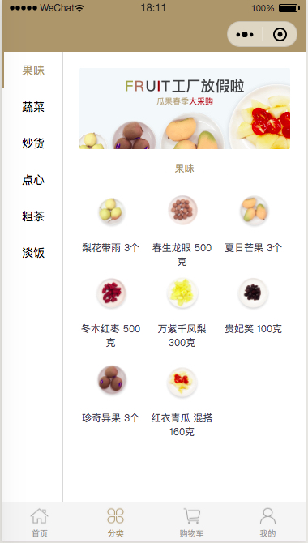
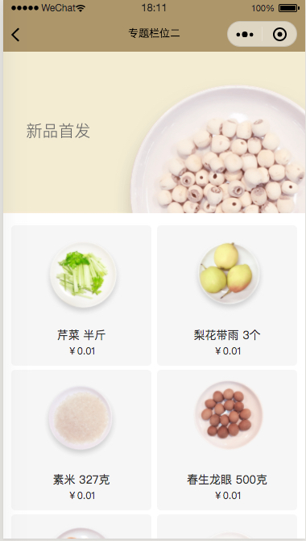
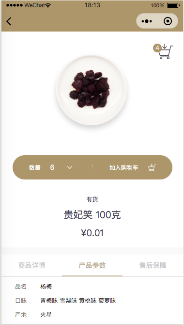
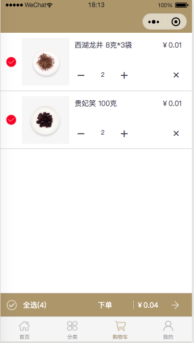
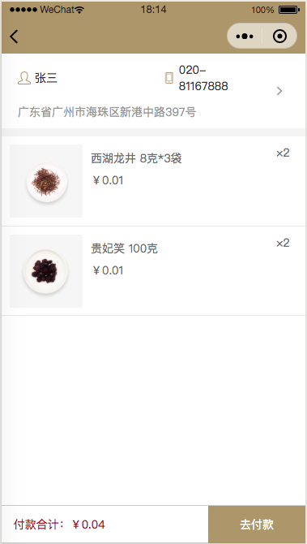
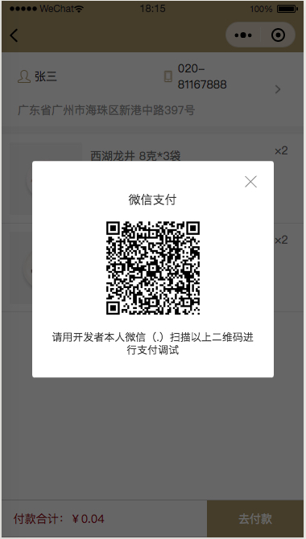
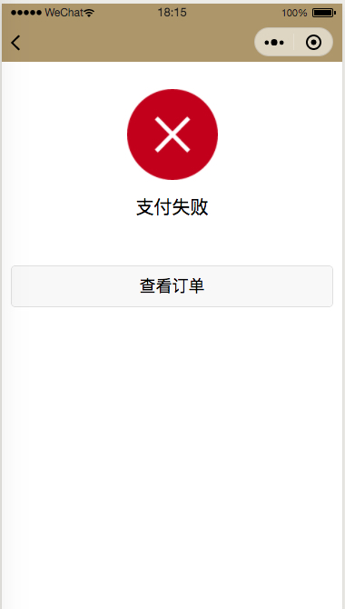
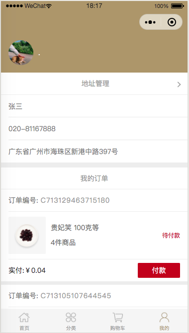
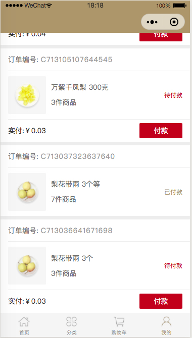

#   微信小程序
#   对应后台
#   [https://github.com/3199360041/wechat-mall-backend.git](https://github.com/3199360041/wechat-mall-backend.git)


需要修改utils/config.js文件中的变量
```javascript

class Config{
  constructor(){}
}

Config.restUrl = 'http://127.0.0.1:8000/api/v1/';

export { Config }

```

#   预览图

###   首页

###   分类页

###   主题页

###   商品页

###   购物车

###   下订单

###   订单支付

###   订单支付失败

###   用户信息

